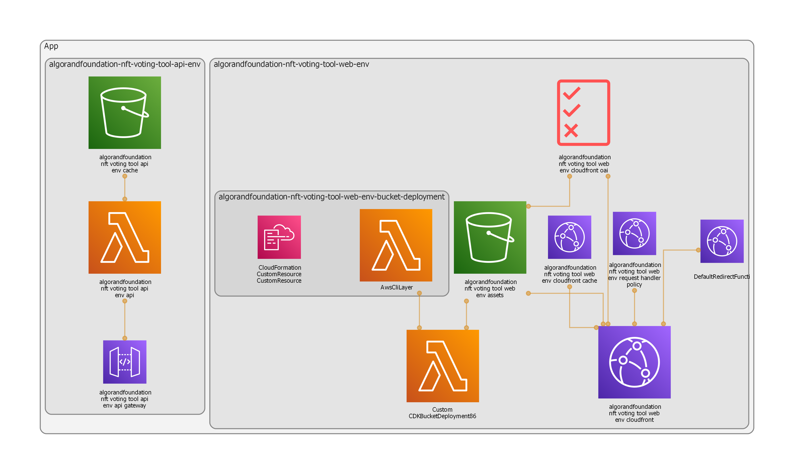

# AWS CDK Infrastructure as Code

The `cdk.json` file tells the CDK Toolkit how to execute your app.

- `.bin` contains the entry point that orchestrates everything
- `lib` contains the stacks
- `test` contains tests

## Logical architecture

## Physical architecture

## Getting started

1. Open repository in VS Code
2. Install recommended extensions
3. Install graphviz
4. Copy `.env.template` to `.env` and fill in the values
5. Ensure the "Run and Debug" configuration in VS Code is set to "Deploy AWS" and hit F5

## Generating physical architecture diagram

Ensure the "Run and Debug" configuration in VS Code is set to "Generate AWS Diagram" and hit F5, or execute `npm run graph:local`.

## Useful commands

- `npm run build` - Compile TypeScript to JavaScript and prepare for standalone deployment artifact in `build` folder
- `npm run deploy:local` - Deploy this stack using the values in `.env`
- `npm run deploy` - Deploy this stack on a CI server, pulling values from the environment
- `npm run diff:local` - Compare deployed stack with current state using the values in `.env`
- `npm run diff` - Compare deployed stack with current state on a CI server, pulling values from the environment
- `npm run destroy:local` - Deletes all deployed stacks using the values in `.env`
